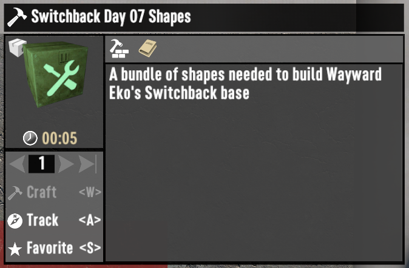
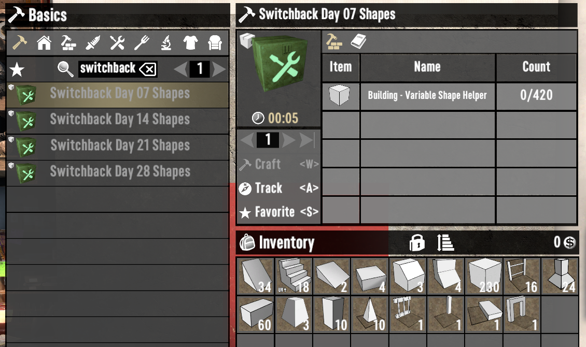
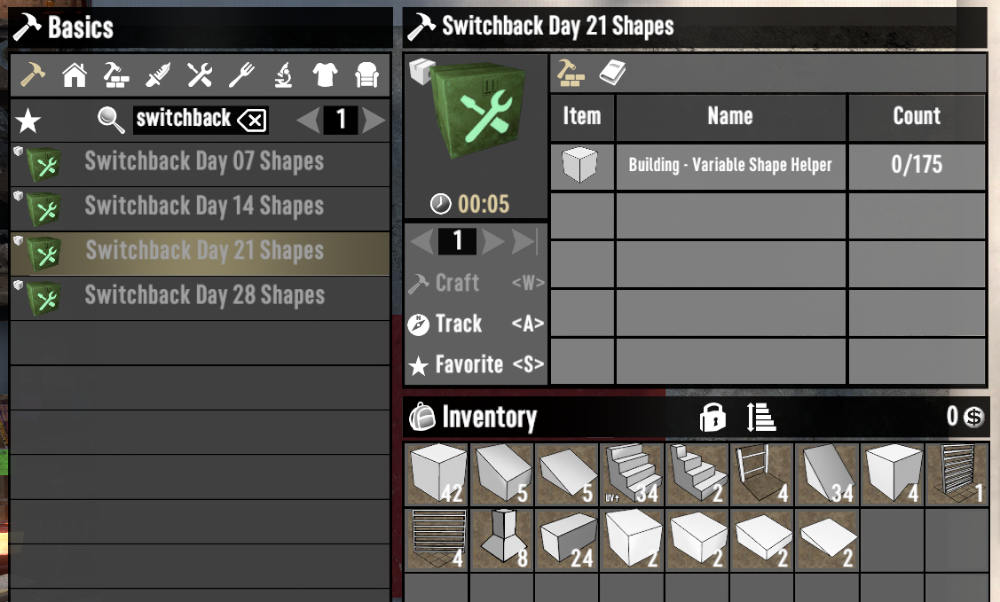
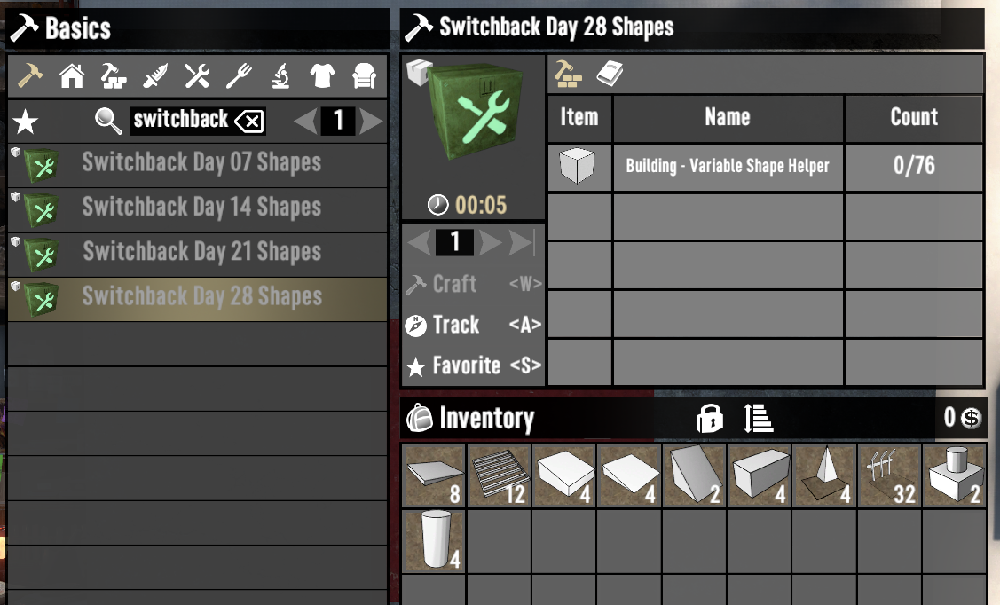
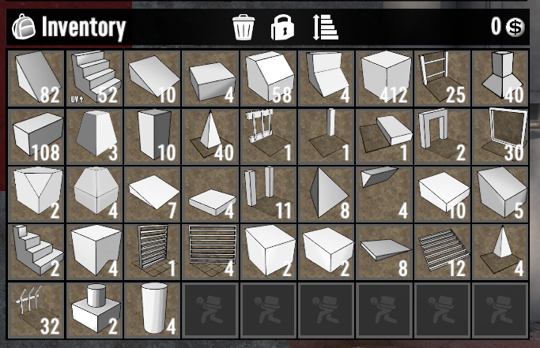

# ISI Frame Bundles

Same as `ISI Build Bundles`, but all of the finished shapes (wood, cobblestone, concrete, etc., ) have been replaced with frame.

Frames can be picked up if misplaced while finished shapes cannot. The tradeoff is that it will require more resources to upgrade.

## Included Bases

- [WaywardEko - Switchback](https://www.youtube.com/watch?v=Bv4Lk7UkkV4)
- [WaywardEko - Seeker's Bane](https://www.youtube.com/watch?v=jEMnP7sHEzo)

## Example

